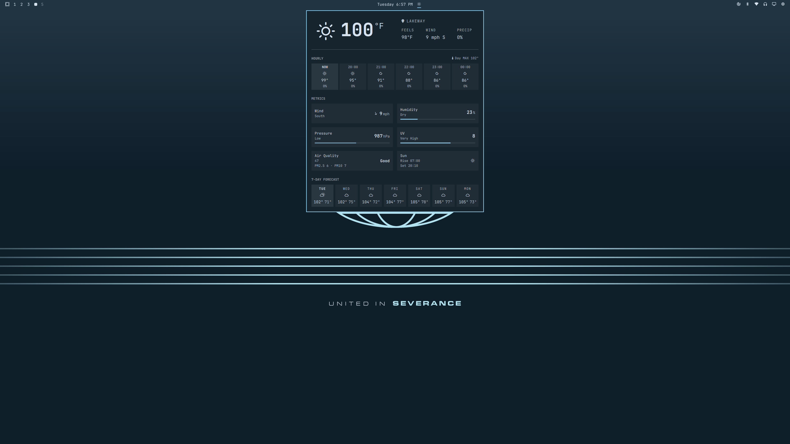

# Weathering

A weather widget for the [Omarchy](https://omarchy.org) bar. One pill in the
bar; one panel with a sectioned layout: a current-conditions hero, metric cells
(wind, humidity, pressure, UV index, air quality, sun), an hourly strip, and a
7-day forecast. All data comes from [Open-Meteo](https://open-meteo.com) — no
API key, no account.

<p align="center"></p>

## Features

| Section | Shows |
|---------|-------|
| **Current** | condition glyph, big temperature, location (click to search), feels-like / wind / precipitation chance |
| **Metrics** | filled cells: wind (speed + compass arrow), humidity, pressure, UV index, air quality, sun (rise/set) — level bars on humidity / pressure / UV |
| **Hourly** | six upcoming hours: time (NOW highlighted), condition glyph, temperature, precipitation probability, day MAX readout |
| **7-day** | one cell per day (today highlighted): condition, hi/lo |
| **Air quality** | US AQI number with health category (Good → Hazardous) plus PM2.5 / PM10 |
| **Location** | click the location label to search cities (Open-Meteo geocoding); empty commit returns to IP auto-detect |

The panel uses the theme's popup surface, so it follows dark and light themes.
Everything is metric or imperial aware (auto / metric / imperial, or per your
locale). The hourly strip and air-quality section can be hidden via the
`showHourly` and `showAirQuality` settings (see [Configure](#configure)).

## Install

```sh
omarchy plugin add https://github.com/howdyitskyle/weathering-omarchy-plugin.git --enable
```

`omarchy plugin add` installs safely: it clones the repo to a temporary
folder, **validates the `manifest.json`** against Omarchy's plugin schema, and
refuses to add anything invalid. It also refuses to overwrite an existing
install — if the plugin id is already in use, it stops and tells you to use
`omarchy plugin update` instead. Only after validation does it move the plugin
into `~/.config/omarchy/plugins/<id>/` and (with `--enable`) ask where to place
the bar pill.

Then move it where you like on the bar (it lands in the right section by
default):

```sh
omarchy bar move io.github.howdyitskyle.weathering --section center
```

## Use

Click the pill to open or close the panel. Press Escape to close it. Middle-click
refreshes; right-click sends the current conditions as a notification. Inside
the panel, click the location label (top right) to search for a city; pressing
Escape or committing an empty search returns to automatic IP-based location.

Bind a key if you like, in `~/.config/hypr/bindings.lua` (Hyprland's
bindings file — `bindd` is a superkey chord binding, so this one is
`SUPER + CTRL + W`):

```lua
bindd = SUPER CTRL, W, Weathering, exec, omarchy-shell shell toggle io.github.howdyitskyle.weathering '{}'
```

## Location

The plugin shares its location with the built-in `omarchy.weather` widget via
`~/.local/state/omarchy/settings/weather.json`, so setting a location in either
one keeps both in sync. Without a configured location the panel auto-detects
from your IP address.

## Configure

`omarchy bar` › the Weathering widget has these settings:

| Key | Default | Meaning |
|-----|---------|---------|
| `unit` | `auto` | `auto` / `metric` / `imperial` |
| `refreshMinutes` | `15` | refresh interval, 5–120 min |
| `showHourly` | `true` | show the hourly strip |
| `showAirQuality` | `true` | show the air-quality section |
| `showMetrics` | `true` | show the METRICS grid (wind, humidity, pressure, UV) |
| `showSun` | `true` | show the sun rise/set cell in the metrics grid |
| `show7day` | `true` | show the 7-day forecast strip |
| `showFeelsLike` | `true` | show the feels-like stat in the header |
| `hourlyCells` | `6` | number of hourly forecast cells to show (3–6) |

Settings are inline on the widget's bar-layout entry in
`~/.config/omarchy/shell.json`. For example, to force imperial units, refresh
every 10 minutes, hide the air-quality section, and show only 4 hourly cells,
add the keys to the entry:

```json
{
  "bar": {
    "layout": {
      "center": [
        {
          "id": "omarchy.clock"
        },
        {
          "id": "io.github.howdyitskyle.weathering",
          "unit": "imperial",
          "refreshMinutes": 10,
          "showAirQuality": false,
          "hourlyCells": 4
        }
      ]
    }
  }
}
```

The entry lives wherever you placed the widget (in the example above, in the
bar's `center` layout, next to the clock). `shell.json` hot-reloads on save, so
no restart is needed — the change takes effect immediately. You can also set
these from the settings form in `omarchy bar` rather than editing the file by
hand.

## Data

Weather + geocoding come from Open-Meteo's free APIs (`api.open-meteo.com`,
`air-quality-api.open-meteo.com`, `geocoding-api.open-meteo.com`). There is no
account, key, or rate plan. The panel fetches on open, on location change, and
on a refresh timer that runs every `refreshMinutes` (even while the panel is
closed) so the bar pill stays current.

## Remove

```sh
omarchy plugin remove io.github.howdyitskyle.weathering
```

Removal is safe. Omarchy first disables and unloads the plugin from the
running `omarchy-shell`, then — because a git-installed plugin's source lives
upstream — it deletes the local copy. If you instead installed the folder
manually (no git repo), the folder is **backed up** to
`~/.config/omarchy/plugins/.io.github.howdyitskyle.weathering.bak.<timestamp>`
rather than deleted, so you can recover it if needed.

## Security

Omarchy plugins run as **unsandboxed code** inside your long-lived
`omarchy-shell` process, with your user's permissions. Only install plugins you
trust, and review the source before enabling. This plugin only reads weather
data from Open-Meteo over HTTPS and shares your location via
`omarchy-weather-location` — it does not ship or run any external scripts.

## License

MIT — see [LICENSE](LICENSE).